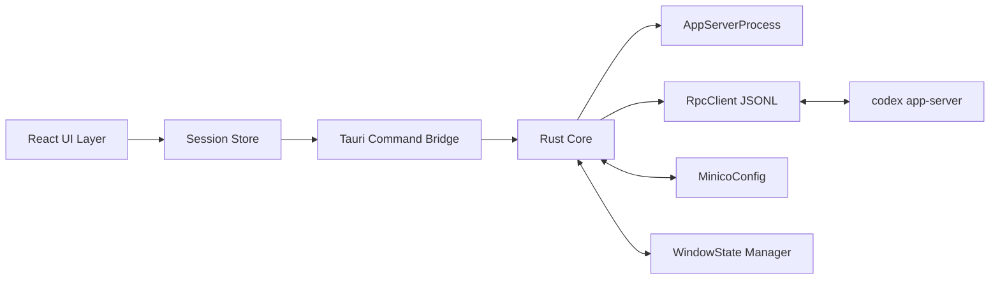
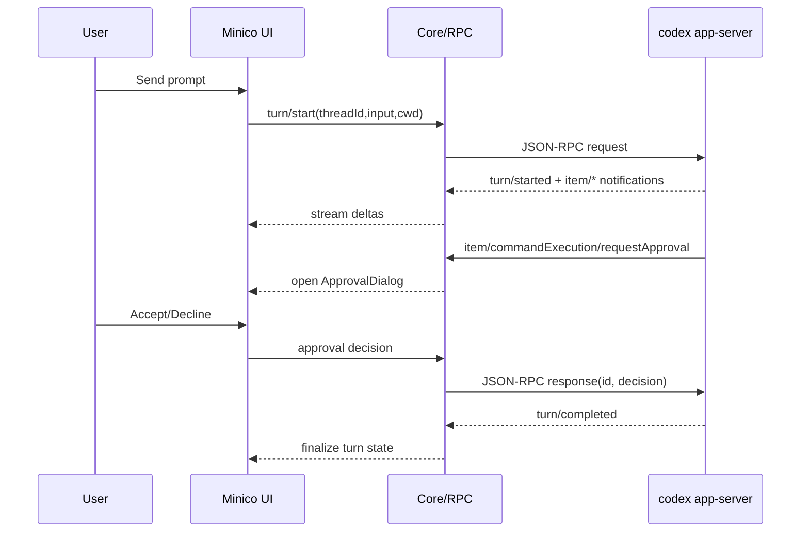

# Implementation Plan: Minico V0 Codex App-Server Integration

## Overview

Build Minico V0 as a desktop app that talks to `codex app-server` over stdio JSON-RPC, supports ChatGPT managed OAuth only, renders streaming turns, handles approval requests, and persists minimal Minico-specific settings plus UX-only local preferences.

## Goal

A user can launch Minico, authenticate with ChatGPT managed OAuth, start/resume a thread, run a turn with streaming output, approve or decline command/file-change requests, and safely restore window placement across monitor/DPI changes.

## Scope

- Included:
  - Desktop shell bootstrap (Tauri v2 + React + TypeScript)
  - `codex app-server` process spawn and JSON-RPC client
  - `initialize` handshake and lifecycle recovery
  - ChatGPT-only auth flow and API-key-auth guard
  - Thread list/start/resume, turn start/interrupt, streaming item rendering
  - Approval dialogs for command execution and file changes
  - Minimal Minico config (`codex.path`, `codex.homeIsolation`, `window.placement`)
  - UX-only local preferences (`workspace.lastPath`, `diagnostics.logLevel`)
  - Safe window placement restore with clamping and monitor checks
  - Error mapping, diagnostics logging, and V0 verification docs
- Excluded:
  - API key login support
  - Direct OpenAI HTTP API integration
  - Embedded `codex` binary distribution
  - Long-running background task orchestration
  - Advanced P1 features (`thread/archive`, `thread/name/set`, `thread/compact/start`)

## Prerequisites

- Rust stable toolchain and Node.js LTS available on development machines.
- `codex` CLI installed locally for runtime verification.
- Familiarity with JSON-RPC 2.0 request/response semantics.
- Access to PRD and detailed specification in `specs/`.

## Sources

| Source | URL / Identifier | Description |
|--------|-------------------|-------------|
| Product Requirements Document | `specs/prd.md` | V0 goals, non-goals, acceptance criteria, and policy constraints |
| Detailed Design | `specs/spec.md` | Module design, RPC behavior, auth flow, approvals, config, and window restore algorithm |
| Tauri v2 docs (Context7) | `/tauri-apps/tauri-docs` | Window state plugin behavior and shell process spawning guidance |

## Design

### Architecture and Component Structure

### Data Flow and Key Interactions

### API Contracts and Internal Interfaces

- Rust `AppServerProcess`:
  - `spawn(codex_path: Option<PathBuf>, env: HashMap<String, String>) -> Result<ChildHandle>`
  - `restart(reason: RestartReason) -> Result<()>`
- Rust `RpcClient`:
  - `request<TReq, TRes>(method: &str, params: TReq) -> Result<TRes>`
  - `notify<TReq>(method: &str, params: TReq) -> Result<()>`
  - `on_server_request(handler: ServerRequestHandler)`
- Rust `CodexFacade` typed methods:
  - `initialize()`, `account_read()`, `account_login_start_chatgpt()`
  - `thread_start()`, `thread_resume()`, `thread_list_app_server_only()`
  - `turn_start()`, `turn_interrupt()`
  - `respond_approval()`
- Frontend store contracts:
  - `session.authState`, `session.currentThreadId`, `session.activeTurnId`
  - `ui.pendingApproval`, `ui.streamBuffer`, `ui.errorBanner`

### Key Business Logic

- Authentication gate:
  - If `authMode == "apikey"` from `account/read`, force explicit logout path before enabling chat.
- Backpressure strategy:
  - Retry JSON-RPC request on `error.code == -32001` with capped exponential backoff (200ms, 400ms, 800ms, 1600ms, 3200ms).
- History separation:
  - Always call `thread/list` with `sourceKinds: ["appServer"]`.
- Home isolation:
  - Inject `CODEX_HOME=$HOME/.minico/codex/` only when `codex.homeIsolation == true`.
- Window restore safety:
  - Convert saved placement to current coordinate space, clamp to monitor work areas, and center on primary monitor if fully off-screen.

### UI/UX Design

- Design system:
  - Typography: `Noto Sans JP` for Japanese UI text and `IBM Plex Mono` for command/diff blocks.
  - Colors (CSS variables): neutral background, high-contrast foreground, dedicated warning/error/success tokens.
  - Spacing: 4/8/12/16/24 scale, consistent panel rhythm.
- User flows:
  - Startup -> account check -> login (if needed) -> thread list/new thread -> turn streaming -> approval (if requested) -> completion.
  - Settings flow for `codex.path` and `homeIsolation` toggle with immediate validation feedback.
- Interaction patterns:
  - Streaming text appears incrementally with preserved line wrapping.
  - Approval modal blocks destructive decisions until explicit user action.
  - Interrupt action is always available for active turn.
- Accessibility:
  - Keyboard navigable dialogs and thread list.
  - Focus trap in modals, visible focus indicators, semantic labels for screen readers.
  - Contrast target aligned with WCAG 2.1 AA.

## Decisions

| Topic | Decision | Rationale |
|-------|----------|-----------|
| Desktop stack | Use Tauri v2 with React + TypeScript frontend and Rust core | Supports local process control, window APIs, and compact desktop distribution |
| Runtime command | Always execute `<codex> app-server` (no user-defined args) | Matches PRD constraint and keeps startup behavior deterministic |
| Default workspace | Use `$HOME/.minico/workspace` when user has not picked a folder | Aligns with spec requirement that `cwd` is always set |
| UX preference persistence | Persist workspace and diagnostics log-level as Minico-local UX state | Keeps convenience settings local without modifying Codex policy/config |
| Unsupported auth mode | Detect API-key auth and require logout before ChatGPT login | Enforces product policy: ChatGPT managed OAuth only |
| Approval fallback | If approval dialog cannot be shown, return `Cancel` and surface recoverable error | Preserves explicit-consent model and avoids silent execution |
| Window persistence | Implement custom safety checks even if plugin restore is used | Prevents off-screen windows after DPI/monitor topology changes |

## Tasks

### X1: Bootstrap Desktop Workspace and Build Baseline

- **ID**: `07dc6221-022c-4efa-baf2-981aaf8f0818`
- **Category**: `other`
- **File(s)**: `package.json`, `pnpm-lock.yaml`, `src-tauri/Cargo.toml`, `src-tauri/src/main.rs`, `src/main.tsx`, `src/App.tsx`, `tsconfig.json`, `.editorconfig`, `.gitignore`

#### Description

Create the project skeleton for a Tauri v2 desktop application with a React/TypeScript UI and Rust host runtime. This task establishes the baseline build/test/lint workflow and a minimal app shell that can host subsequent integration work.

#### Details

- Initialize frontend and Tauri host structure with a single main window.
- Add linting, formatting, and test scaffolding for both TypeScript and Rust.
- Define shared directory layout:
  - `src/core` for frontend-side domain logic and state store
  - `src/ui` for views/components
  - `src-tauri/src/core` for process/RPC/config modules
- Add CI-ready scripts:
  - `pnpm lint`, `pnpm test`, `pnpm tauri dev`, `cargo test --manifest-path src-tauri/Cargo.toml`

#### Acceptance Criteria

- [ ] `pnpm tauri dev` launches a desktop window without runtime errors.
- [ ] `pnpm lint` and `pnpm test` execute successfully with baseline scaffolding.
- [ ] `cargo test --manifest-path src-tauri/Cargo.toml` runs and reports passing baseline tests.
- [ ] Directory structure matches planned module boundaries.

### X2: Implement MinicoConfig and Codex Path/Home Isolation Policy

- **ID**: `80bfdcdd-f4c0-4be3-9e5e-b33ba07f3324`
- **Category**: `other`
- **File(s)**: `src-tauri/src/core/config.rs`, `src-tauri/src/core/paths.rs`, `src/core/settings/types.ts`, `src/core/settings/store.ts`, `src/ui/settings/SettingsView.tsx`

#### Description

Implement minimal app configuration storage and validation logic, including `codex.path`, `codex.homeIsolation`, schema version handling, and UX-local preference fields used by workspace and diagnostics features.

#### Details

- Persist config at OS-appropriate Minico config path (e.g. `$HOME/.minico/config.json`).
- Support schema:
  - `schema_version`
  - `codex.path: string | null`
  - `codex.homeIsolation: boolean`
  - `workspace.lastPath: string | null`
  - `diagnostics.logLevel: "error" | "warn" | "info" | "debug"`
  - `window.placement` placeholder fields for later task integration
- Validate `codex.path` existence/executable status before allowing save.
- On `homeIsolation=true`, ensure `$HOME/.minico/codex/` directory exists and do not create `config.toml`.
- Expose typed settings API used by X4 (workspace resolver) and D1 (diagnostics level UI).
- Add settings UI control for diagnostics log level and persist the selected level.
- Add migration guard for unknown future fields (ignore, preserve where feasible).

#### Acceptance Criteria

- [ ] Settings persist across app restart.
- [ ] Invalid `codex.path` shows user-facing validation error and blocks launch attempt.
- [ ] `homeIsolation` toggles effective `CODEX_HOME` behavior in stored state.
- [ ] `workspace.lastPath` and `diagnostics.logLevel` are persisted and available through typed settings selectors.
- [ ] Unit tests cover config parse, defaults, and migration behavior.

### X4: Implement Workspace Selection and CWD Resolution

- **ID**: `98fe7db4-0b9f-4d08-b361-6e0c4d15cc76`
- **Category**: `other`
- **File(s)**: `src-tauri/src/core/workspace.rs`, `src/core/workspace/workspaceStore.ts`, `src/ui/settings/WorkspacePicker.tsx`

#### Description

Implement workspace path management so every `thread/start` and `turn/start` request has a valid `cwd`. This task covers default workspace bootstrapping, user-selected workspace persistence, and runtime validation.

#### Details

- Ensure default workspace directory exists at `$HOME/.minico/workspace` when no explicit workspace is set.
- Add workspace picker UI to allow selecting and changing the active workspace folder.
- Persist selected workspace path via X2 settings API and validate readability/writability before use.
- Provide `resolveActiveCwd()` utility used by thread and turn APIs to avoid missing `cwd`.
- Handle deleted/moved workspace paths with fallback to default workspace and user-facing warning.

#### Acceptance Criteria

- [ ] App startup creates and uses `$HOME/.minico/workspace` when no workspace has been selected.
- [ ] User-selected workspace path persists across restart and is reused for subsequent requests.
- [ ] `thread/start` and `turn/start` always receive a valid `cwd` from the resolver.
- [ ] Tests cover fallback when stored workspace path becomes unavailable.

### B1: Build AppServerProcess and JSON-RPC Transport Core

- **ID**: `1ec318b7-42ba-4683-82c7-2e204f815122`
- **Category**: `backend`
- **File(s)**: `src-tauri/src/core/app_server_process.rs`, `src-tauri/src/core/rpc_client.rs`, `src-tauri/src/core/jsonl_codec.rs`, `src-tauri/src/core/events.rs`

#### Description

Implement process lifecycle and JSONL transport to communicate with `codex app-server`. This includes stdio wiring, request/response correlation, notification dispatching, and server-initiated request handling.

#### Details

- Spawn command resolution:
  - Use configured `codex.path` when provided.
  - Otherwise rely on PATH resolution for `codex`.
  - Always append `app-server`.
- Implement line-delimited JSON encoding/decoding with robust parse error reporting.
- Maintain pending request map (`id -> responder`) with monotonic client request IDs.
- Route server-initiated requests (approval requests) to UI event channel while preserving request IDs for response.
- Capture stderr logs separately for diagnostics.

#### Acceptance Criteria

- [ ] Process starts with both default PATH mode and explicit `codex.path` mode.
- [ ] JSON-RPC requests receive matched responses under concurrent load.
- [ ] Notifications and server requests are emitted to consumers without blocking request flow.
- [ ] Rust unit/integration tests cover request correlation and malformed JSONL handling.

### B2: Implement CodexFacade Handshake, Retry, and Recovery

- **ID**: `21c3b1e3-9a60-4a12-9247-40a1e4bb75b0`
- **Category**: `backend`
- **File(s)**: `src-tauri/src/core/codex_facade.rs`, `src-tauri/src/core/retry.rs`, `src-tauri/src/core/lifecycle.rs`

#### Description

Add typed wrappers for app-server API methods and enforce lifecycle rules around `initialize -> initialized` before functional requests. Include retry for overload errors and controlled process restart/reconnect behavior.

#### Details

- Implement startup sequence:
  - spawn process
  - send `initialize` with fixed `clientInfo` (`name/title = "minico"`, app version)
  - send `initialized` notification
- Wrap core methods with typed request/response structures:
  - `account/read`, `account/login/start`, `account/logout`
  - `thread/start`, `thread/resume`, `thread/list`
  - `turn/start`, `turn/interrupt`
- Generate app-server JSON schema snapshot (`codex app-server generate-json-schema`) and enforce type alignment checks in CI to detect payload-shape drift.
- Apply capped exponential retry on `-32001`.
- On unexpected process exit, restart with bounded retries and re-run handshake plus `account/read`.

#### Acceptance Criteria

- [ ] Any request attempted before handshake completion is rejected with clear internal error.
- [ ] `-32001` responses trigger retry policy and produce final user-safe error after max retries.
- [ ] Build/CI fails when local app-server type bindings diverge from generated schema snapshot.
- [ ] Process crash simulation triggers restart and successful re-initialization path.
- [ ] Integration tests validate handshake and recovery behavior.

### B3: Implement ChatGPT-Only Authentication State Machine

- **ID**: `d80776d0-769f-49fc-90ad-49c5a580d6a0`
- **Category**: `backend`
- **File(s)**: `src-tauri/src/core/auth.rs`, `src/core/session/authMachine.ts`, `src/ui/login/LoginView.tsx`

#### Description

Implement startup auth check, ChatGPT login start flow, and API-key-auth rejection behavior. This task enforces product policy that Minico supports managed ChatGPT OAuth only.

#### Details

- On startup call `account/read { refreshToken: false }` and map response to UI states:
  - logged in (`chatgpt`)
  - login required
  - unsupported (`apikey`)
- For login required:
  - call `account/login/start { type: "chatgpt" }`
  - open returned `authUrl` in system browser
  - wait for `account/login/completed` and/or `account/updated` notifications
- For `apikey` mode:
  - show unsupported message
  - provide `Logout and continue` flow via `account/logout`

#### Acceptance Criteria

- [ ] User can complete ChatGPT login from a clean local account state.
- [ ] API-key-auth state is blocked and cannot proceed without logout.
- [ ] Login state transitions are reflected in UI without app restart.
- [ ] Tests cover all auth-mode branches and notification-driven transitions.

### B4: Implement Thread/Turn Orchestration and Streaming Model

- **ID**: `daeb1d97-3fc6-4cf3-830b-61370903bf55`
- **Category**: `backend`
- **File(s)**: `src-tauri/src/core/thread_turn.rs`, `src/core/chat/turnReducer.ts`, `src/core/chat/threadService.ts`

#### Description

Implement thread and turn domain logic, including filtered history listing, thread creation/resume, turn start/interrupt, and item-stream event normalization for frontend consumption.

#### Details

- History:
  - `thread/list` must always pass `sourceKinds: ["appServer"]`.
- Thread lifecycle:
  - `thread/start` with required `cwd` from workspace resolver.
  - `thread/resume` for selected history item.
- Turn lifecycle:
  - `turn/start` with text input payload and resolved `cwd`.
  - stream events: `turn/started`, `item/started`, `item/agentMessage/delta`, `item/completed`, `turn/completed`.
  - `turn/interrupt` for active turns.
- Normalize raw events into deterministic reducer-friendly actions.

#### Acceptance Criteria

- [ ] New thread creation and resume from list both function end-to-end.
- [ ] Streaming deltas render in order and finalize correctly on completion.
- [ ] Interrupt operation stops active turn and updates state consistently.
- [ ] Tests verify reducer ordering and thread list filter behavior.

### F1: Build Core UI Screens and Session Wiring

- **ID**: `95fed6da-03b0-48d6-8bdb-c03e41e3922f`
- **Category**: `frontend`
- **File(s)**: `src/ui/chat/ChatView.tsx`, `src/ui/chat/ThreadListPanel.tsx`, `src/ui/login/LoginView.tsx`, `src/ui/settings/SettingsView.tsx`, `src/ui/layout/AppShell.tsx`, `src/styles/tokens.css`

#### Description

Create core UI screens for login, thread list, chat stream, and settings while wiring them to shared session state. This task establishes user-visible flows for V0 before advanced dialogs and diagnostics.

#### Details

- Build responsive app shell with side panel (thread history/settings) and main chat pane.
- Add message composer with submit and interrupt actions.
- Present login-required and unsupported-auth views from auth machine state.
- Implement settings controls for `codex.path`, `homeIsolation`, and workspace selection with validation feedback.
- Define and apply design tokens (color, spacing, typography) in `tokens.css`.

#### Acceptance Criteria

- [ ] User can complete each required route flow: startup -> login-required -> chat, startup -> unsupported-auth -> logout -> login, chat -> settings -> chat.
- [ ] Thread list and active thread state stay synchronized after selection changes.
- [ ] UI supports keyboard navigation and visible focus styles.
- [ ] Component tests explicitly cover login-required, unsupported-auth, active-turn, and settings-validation rendering branches.

### F2: Implement Approval Dialogs and Decision Response Bridge

- **ID**: `a7de5c73-0355-4375-a747-246c5f8c595d`
- **Category**: `frontend`
- **File(s)**: `src/ui/approval/ApprovalDialog.tsx`, `src/ui/approval/FileChangePreview.tsx`, `src/core/approval/approvalStore.ts`, `src/core/approval/approvalBridge.ts`

#### Description

Implement UI and state handling for server-initiated approval requests and map user decisions back to JSON-RPC responses. This task must support both command and file-change approval types.

#### Details

- Handle request types:
  - `item/commandExecution/requestApproval`
  - `item/fileChange/requestApproval`
- Render command details (`command`, `cwd`, `reason`) and file-change diff previews.
- Support decision actions: `accept`, `acceptForSession`, `decline`, `cancel`.
- Preserve request ID correlation so responses target the correct server request.
- Apply fallback behavior (`cancel`) if dialog cannot be presented.

#### Acceptance Criteria

- [ ] Command approval dialog shows complete context and returns selected decision.
- [ ] File-change approval dialog shows affected files and diff details.
- [ ] Decision responses are correlated to the exact incoming request ID.
- [ ] No approval response is sent before explicit user interaction.
- [ ] If dialog presentation fails, system returns deterministic fallback decision (`cancel`) and records diagnostic context.
- [ ] UI/integration tests cover all decision branches and dialog lifecycle behavior.

### X3: Implement Safe Window Placement Persistence

- **ID**: `6e4eb872-72c6-4f8b-86ef-573f2917a3cc`
- **Category**: `other`
- **File(s)**: `src-tauri/src/core/window_state.rs`, `src-tauri/src/core/monitor.rs`, `src/core/window/windowStateClient.ts`

#### Description

Implement robust save/restore behavior for window placement, protecting against off-screen restoration after monitor topology or DPI changes.

#### Details

- Capture and persist:
  - position, size, maximized flag, optional scale factor
- Restore algorithm:
  - query current monitor work areas
  - transform coordinates if scale factor changed
  - detect no-intersection states
  - clamp size to min/max and reposition to visible area
  - apply maximize after safe position/size set
- Integrate with app lifecycle hooks (on close/save, on startup/restore).
- Use plugin support where useful, but keep explicit clamp logic as authoritative.

#### Acceptance Criteria

- [ ] Window restores on-screen after monitor unplug/reconfigure scenarios.
- [ ] DPI scale changes do not produce unusable tiny/oversized/off-screen windows.
- [ ] Maximized restoration order avoids visible flicker/regression.
- [ ] Automated tests validate clamp and monitor intersection logic.

### D1: Add Diagnostics, Error UX, and End-to-End Verification Guide

- **ID**: `acd3fd09-e219-49af-b2c5-68a09656b24e`
- **Category**: `documentation`
- **File(s)**: `docs/v0/verification.md`, `docs/v0/error-catalog.md`, `src/core/errors/errorMapper.ts`, `src/ui/common/ErrorBanner.tsx`

#### Description

Document and implement final operational readiness artifacts for V0: error catalog, user-facing error mapping, diagnostics capture workflow, and full manual verification checklist.

#### Details

- Map technical failures to user-facing actions:
  - Codex binary missing
  - handshake failure/version mismatch
  - auth unauthorized
  - overload after retry exhaustion
- Document expected runtime behavior for each diagnostics log level configured in X2 (`error`, `warn`, `info`, `debug`).
- Add diagnostics export path and instructions for bug reports.
- Author explicit end-to-end verification scenarios that align with PRD DoD.
- Ensure release checklist includes `homeIsolation` behavior and approval flow validation.

#### Acceptance Criteria

- [ ] Error catalog documents trigger condition, user message, and recovery action for each major failure class.
- [ ] End-to-end verification document covers all V0 acceptance criteria from PRD.
- [ ] Log level selector behavior (`error`/`warn`/`info`/`debug`) is documented and manually verified against runtime diagnostics output.
- [ ] Error UI surfaces actionable guidance instead of raw internal errors.
- [ ] Manual dry-run by another engineer can reproduce verification steps without extra context.

## Verification

1. Run automated checks:
   - `pnpm lint`
   - `pnpm test`
   - `cargo test --manifest-path src-tauri/Cargo.toml`
2. Build and launch desktop app:
   - `pnpm tauri dev`
3. Manual end-to-end scenario:
   - Start app with default PATH `codex`
   - Complete ChatGPT login
   - Create thread and run one prompt with streaming response
   - Trigger command approval and file-change approval; verify accept/decline behavior
   - Interrupt a running turn and confirm UI state consistency
   - Restart app and verify window placement restoration
4. Isolation scenario:
   - Enable `homeIsolation`
   - Restart app and verify `CODEX_HOME` isolation behavior and no `config.toml` auto-generation
5. Failure-path scenario:
   - Set invalid `codex.path` and confirm actionable error
   - Simulate overload response and verify retry then user-safe message
